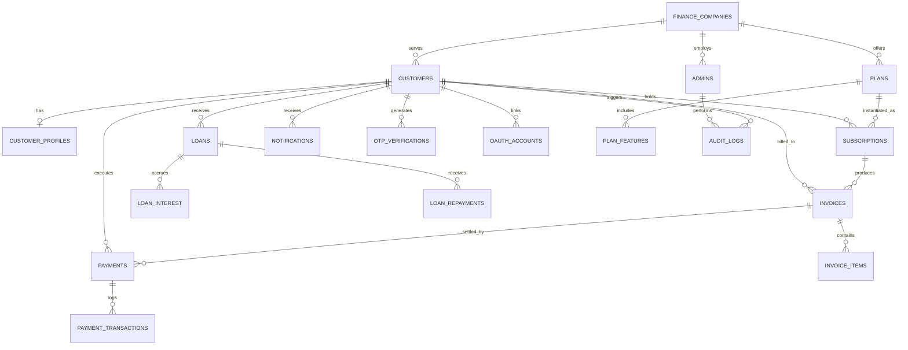

# FinCore Database Architecture & Engineering Specification

**Database Engine:** MySQL 8.0 (InnoDB)  
**Encoding:** `utf8mb4` with collation `utf8mb4_unicode_ci`  
**Schema Definition:** Normalized Relational Database (3NF/BCNF)  

---

## 1. Entity-Relationship (ER) Architecture



---

## 2. Table Specifications & Constraints

### 2.1 Multi-Tenant Core

#### `finance_companies`
| Column | Type | Constraints | Description |
|---|---|---|---|
| `id` | INT AUTO_INCREMENT | PRIMARY KEY | Unique tenant ID |
| `name` | VARCHAR(120) | NOT NULL, UNIQUE | Registered business name |
| `code` | VARCHAR(20) | NOT NULL, UNIQUE | Company identification code |
| `license_number` | VARCHAR(60) | NOT NULL, UNIQUE | Regulatory banking license |
| `contact_email` | VARCHAR(120) | NOT NULL | Official company email |
| `contact_phone` | VARCHAR(30) | NOT NULL | Phone contact |
| `address` | TEXT | NULL | Registered office address |
| `is_active` | BOOLEAN | NOT NULL DEFAULT TRUE | Tenant status flag |
| `created_at` | DATETIME | NOT NULL DEFAULT CURRENT_TIMESTAMP | Record created timestamp |
| `updated_at` | DATETIME | NOT NULL DEFAULT CURRENT_TIMESTAMP ON UPDATE CURRENT_TIMESTAMP | Modification timestamp |

#### `admins`
| Column | Type | Constraints | Description |
|---|---|---|---|
| `id` | INT AUTO_INCREMENT | PRIMARY KEY | Unique Admin ID |
| `finance_company_id` | INT | NOT NULL, FK(`finance_companies.id`) ON DELETE CASCADE | Associated tenant |
| `email` | VARCHAR(120) | NOT NULL, UNIQUE | Login email |
| `hashed_password` | VARCHAR(255) | NOT NULL | Bcrypt hash |
| `full_name` | VARCHAR(120) | NOT NULL | Admin personal name |
| `role` | VARCHAR(30) | NOT NULL DEFAULT 'admin' | Admin role (`super_admin`, `admin`, `compliance`) |
| `is_active` | BOOLEAN | NOT NULL DEFAULT TRUE | Active status |
| `created_at` | DATETIME | NOT NULL DEFAULT CURRENT_TIMESTAMP | Creation timestamp |
| `updated_at` | DATETIME | NOT NULL DEFAULT CURRENT_TIMESTAMP ON UPDATE CURRENT_TIMESTAMP | Update timestamp |

---

### 2.2 Customer & Profile Entities

#### `customers`
| Column | Type | Constraints | Description |
|---|---|---|---|
| `id` | INT AUTO_INCREMENT | PRIMARY KEY | Unique Customer ID |
| `finance_company_id` | INT | NOT NULL, FK(`finance_companies.id`) ON DELETE RESTRICT | Tenant company |
| `email` | VARCHAR(120) | NOT NULL, UNIQUE | Customer email |
| `hashed_password` | VARCHAR(255) | NOT NULL | Encrypted password |
| `first_name` | VARCHAR(60) | NOT NULL | Given name |
| `last_name` | VARCHAR(60) | NOT NULL | Family name |
| `is_verified` | BOOLEAN | NOT NULL DEFAULT FALSE | Email/OTP verification state |
| `is_active` | BOOLEAN | NOT NULL DEFAULT TRUE | Account state |
| `created_at` | DATETIME | NOT NULL DEFAULT CURRENT_TIMESTAMP | Registration timestamp |
| `updated_at` | DATETIME | NOT NULL DEFAULT CURRENT_TIMESTAMP ON UPDATE CURRENT_TIMESTAMP | Update timestamp |

#### `customer_profiles`
| Column | Type | Constraints | Description |
|---|---|---|---|
| `id` | INT AUTO_INCREMENT | PRIMARY KEY | Profile ID |
| `customer_id` | INT | NOT NULL, UNIQUE, FK(`customers.id`) ON DELETE CASCADE | 1-to-1 customer linkage |
| `phone_number` | VARCHAR(30) | NULL | Customer contact number |
| `address_line1` | VARCHAR(255) | NULL | Street address |
| `city` | VARCHAR(100) | NULL | City |
| `state` | VARCHAR(100) | NULL | State/Province |
| `postal_code` | VARCHAR(20) | NULL | Postal/ZIP code |
| `country` | VARCHAR(60) | NOT NULL DEFAULT 'United States' | ISO country |
| `credit_score` | INT | NULL DEFAULT 700 | Simulated financial rating |
| `created_at` | DATETIME | NOT NULL DEFAULT CURRENT_TIMESTAMP | Creation timestamp |
| `updated_at` | DATETIME | NOT NULL DEFAULT CURRENT_TIMESTAMP ON UPDATE CURRENT_TIMESTAMP | Update timestamp |

---

### 2.3 Subscription & Plan Engine

#### `plans`
| Column | Type | Constraints | Description |
|---|---|---|---|
| `id` | INT AUTO_INCREMENT | PRIMARY KEY | Plan ID |
| `finance_company_id` | INT | NOT NULL, FK(`finance_companies.id`) ON DELETE CASCADE | Issuing finance company |
| `name` | VARCHAR(100) | NOT NULL | Plan name (e.g. Standard, Premium) |
| `code` | VARCHAR(40) | NOT NULL | Unique code per company |
| `description` | TEXT | NULL | Marketing and details summary |
| `price` | DECIMAL(12,2) | NOT NULL | Base subscription price |
| `billing_cycle` | VARCHAR(20) | NOT NULL DEFAULT 'monthly' | `monthly`, `quarterly`, `annual` |
| `interest_discount_rate`| DECIMAL(5,2) | NOT NULL DEFAULT 0.00 | % discount on base loan interest |
| `is_active` | BOOLEAN | NOT NULL DEFAULT TRUE | Availability status |
| `created_at` | DATETIME | NOT NULL DEFAULT CURRENT_TIMESTAMP | Creation timestamp |
| `updated_at` | DATETIME | NOT NULL DEFAULT CURRENT_TIMESTAMP ON UPDATE CURRENT_TIMESTAMP | Update timestamp |

#### `plan_features`
| Column | Type | Constraints | Description |
|---|---|---|---|
| `id` | INT AUTO_INCREMENT | PRIMARY KEY | Feature ID |
| `plan_id` | INT | NOT NULL, FK(`plans.id`) ON DELETE CASCADE | Associated plan |
| `feature_key` | VARCHAR(60) | NOT NULL | Feature slug/identifier |
| `feature_label` | VARCHAR(150) | NOT NULL | Display text |
| `is_included` | BOOLEAN | NOT NULL DEFAULT TRUE | Feature inclusion flag |

#### `subscriptions`
| Column | Type | Constraints | Description |
|---|---|---|---|
| `id` | INT AUTO_INCREMENT | PRIMARY KEY | Subscription ID |
| `customer_id` | INT | NOT NULL, FK(`customers.id`) ON DELETE RESTRICT | Subscribed customer |
| `plan_id` | INT | NOT NULL, FK(`plans.id`) ON DELETE RESTRICT | Active plan |
| `status` | VARCHAR(30) | NOT NULL DEFAULT 'active' | `active`, `pending`, `cancelled`, `expired` |
| `start_date` | DATETIME | NOT NULL DEFAULT CURRENT_TIMESTAMP | Start timestamp |
| `end_date` | DATETIME | NOT NULL | Next renewal or expiration date |
| `auto_renew` | BOOLEAN | NOT NULL DEFAULT TRUE | Auto-renewal configuration |
| `created_at` | DATETIME | NOT NULL DEFAULT CURRENT_TIMESTAMP | Record timestamp |
| `updated_at` | DATETIME | NOT NULL DEFAULT CURRENT_TIMESTAMP ON UPDATE CURRENT_TIMESTAMP | Record update timestamp |

---

### 2.4 Billing, Invoicing & Payments

#### `invoices`
| Column | Type | Constraints | Description |
|---|---|---|---|
| `id` | INT AUTO_INCREMENT | PRIMARY KEY | Invoice ID |
| `invoice_number` | VARCHAR(60) | NOT NULL, UNIQUE | Formatted sequence (e.g. `INV-2026-0001`) |
| `customer_id` | INT | NOT NULL, FK(`customers.id`) ON DELETE RESTRICT | Billed customer |
| `subscription_id`| INT | NULL, FK(`subscriptions.id`) ON DELETE SET NULL | Related subscription |
| `finance_company_id` | INT | NOT NULL, FK(`finance_companies.id`) ON DELETE RESTRICT | Issuing tenant |
| `status` | VARCHAR(25) | NOT NULL DEFAULT 'ISSUED' | `DRAFT`, `ISSUED`, `PENDING`, `PAID`, `OVERDUE`, `CANCELLED` |
| `subtotal` | DECIMAL(15,2) | NOT NULL | Net sum before taxes |
| `tax_amount` | DECIMAL(15,2) | NOT NULL DEFAULT 0.00 | Tax component |
| `discount_amount`| DECIMAL(15,2) | NOT NULL DEFAULT 0.00 | Promotional or plan discount |
| `total_amount` | DECIMAL(15,2) | NOT NULL | Final payable sum |
| `due_date` | DATETIME | NOT NULL | Payment deadline |
| `paid_date` | DATETIME | NULL | Timestamp of settlement |
| `created_at` | DATETIME | NOT NULL DEFAULT CURRENT_TIMESTAMP | Creation timestamp |
| `updated_at` | DATETIME | NOT NULL DEFAULT CURRENT_TIMESTAMP ON UPDATE CURRENT_TIMESTAMP | Update timestamp |

#### `invoice_items`
| Column | Type | Constraints | Description |
|---|---|---|---|
| `id` | INT AUTO_INCREMENT | PRIMARY KEY | Item ID |
| `invoice_id` | INT | NOT NULL, FK(`invoices.id`) ON DELETE CASCADE | Associated invoice |
| `description` | VARCHAR(255) | NOT NULL | Line item description |
| `quantity` | INT | NOT NULL DEFAULT 1 | Quantity |
| `unit_price` | DECIMAL(15,2) | NOT NULL | Unit price |
| `line_total` | DECIMAL(15,2) | NOT NULL | Calculated (`quantity * unit_price`) |

#### `payments`
| Column | Type | Constraints | Description |
|---|---|---|---|
| `id` | INT AUTO_INCREMENT | PRIMARY KEY | Payment ID |
| `payment_reference`| VARCHAR(80) | NOT NULL, UNIQUE | Business reference code |
| `invoice_id` | INT | NOT NULL, FK(`invoices.id`) ON DELETE RESTRICT | Settled invoice |
| `customer_id` | INT | NOT NULL, FK(`customers.id`) ON DELETE RESTRICT | Paying customer |
| `amount` | DECIMAL(15,2) | NOT NULL | Payment amount |
| `status` | VARCHAR(25) | NOT NULL DEFAULT 'PENDING' | `PENDING`, `SUCCESS`, `FAILED` |
| `payment_method` | VARCHAR(40) | NOT NULL DEFAULT 'CREDIT_CARD' | Card, Bank Transfer, Test Gateway |
| `payment_date` | DATETIME | NOT NULL DEFAULT CURRENT_TIMESTAMP | Execution timestamp |
| `created_at` | DATETIME | NOT NULL DEFAULT CURRENT_TIMESTAMP | Record timestamp |

#### `payment_transactions`
| Column | Type | Constraints | Description |
|---|---|---|---|
| `id` | INT AUTO_INCREMENT | PRIMARY KEY | Transaction ID |
| `payment_id` | INT | NOT NULL, FK(`payments.id`) ON DELETE CASCADE | Parent payment |
| `gateway_transaction_id`| VARCHAR(120) | NULL | External gateway ID |
| `gateway_response` | TEXT | NULL | JSON raw log |
| `created_at` | DATETIME | NOT NULL DEFAULT CURRENT_TIMESTAMP | Log timestamp |

---

### 2.5 Loan & Dynamic Interest Management

#### `loans`
| Column | Type | Constraints | Description |
|---|---|---|---|
| `id` | INT AUTO_INCREMENT | PRIMARY KEY | Loan record ID |
| `loan_account_number` | VARCHAR(50) | NOT NULL, UNIQUE | Formatted account number |
| `customer_id` | INT | NOT NULL, FK(`customers.id`) ON DELETE RESTRICT | Recipient customer |
| `finance_company_id` | INT | NOT NULL, FK(`finance_companies.id`) ON DELETE RESTRICT | Funding company |
| `principal_amount` | DECIMAL(15,2) | NOT NULL | Initial sanctioned loan amount |
| `base_interest_rate`| DECIMAL(5,2) | NOT NULL | Base company rate (e.g. 10.50%) |
| `discount_rate` | DECIMAL(5,2) | NOT NULL DEFAULT 0.00 | Benefit applied from plan |
| `effective_interest_rate` | DECIMAL(5,2) | NOT NULL | `base_rate - discount_rate` |
| `term_months` | INT | NOT NULL | Duration in months |
| `current_balance` | DECIMAL(15,2) | NOT NULL | Remaining principal balance |
| `total_interest_accrued`| DECIMAL(15,2) | NOT NULL DEFAULT 0.00 | Total accrued interest |
| `total_paid` | DECIMAL(15,2) | NOT NULL DEFAULT 0.00 | Cumulative repayments made |
| `status` | VARCHAR(30) | NOT NULL DEFAULT 'ACTIVE' | `ACTIVE`, `PAID_OFF`, `DEFAULTED` |
| `disbursed_at` | DATETIME | NOT NULL DEFAULT CURRENT_TIMESTAMP | Disbursal timestamp |
| `created_at` | DATETIME | NOT NULL DEFAULT CURRENT_TIMESTAMP | Creation timestamp |
| `updated_at` | DATETIME | NOT NULL DEFAULT CURRENT_TIMESTAMP ON UPDATE CURRENT_TIMESTAMP | Update timestamp |

#### `loan_interest`
| Column | Type | Constraints | Description |
|---|---|---|---|
| `id` | INT AUTO_INCREMENT | PRIMARY KEY | Interest ledger ID |
| `loan_id` | INT | NOT NULL, FK(`loans.id`) ON DELETE CASCADE | Associated loan |
| `calculation_date` | DATETIME | NOT NULL DEFAULT CURRENT_TIMESTAMP | Accrual date |
| `interest_amount` | DECIMAL(15,2) | NOT NULL | Accrued period interest |
| `is_paid` | BOOLEAN | NOT NULL DEFAULT FALSE | Repayment status |

#### `loan_repayments`
| Column | Type | Constraints | Description |
|---|---|---|---|
| `id` | INT AUTO_INCREMENT | PRIMARY KEY | Repayment ID |
| `loan_id` | INT | NOT NULL, FK(`loans.id`) ON DELETE CASCADE | Associated loan |
| `amount` | DECIMAL(15,2) | NOT NULL | Total installment paid |
| `principal_component`| DECIMAL(15,2) | NOT NULL | Portion applied to principal |
| `interest_component` | DECIMAL(15,2) | NOT NULL | Portion applied to interest |
| `repayment_date` | DATETIME | NOT NULL DEFAULT CURRENT_TIMESTAMP | Payment timestamp |

---

### 2.6 Notifications, Audit Trails & Auth Enhancements

#### `notifications`
| Column | Type | Constraints | Description |
|---|---|---|---|
| `id` | INT AUTO_INCREMENT | PRIMARY KEY | Notification ID |
| `customer_id` | INT | NOT NULL, FK(`customers.id`) ON DELETE CASCADE | Target customer |
| `title` | VARCHAR(150) | NOT NULL | Short subject |
| `message` | TEXT | NOT NULL | Body content |
| `type` | VARCHAR(40) | NOT NULL DEFAULT 'SYSTEM' | `BILLING`, `LOAN`, `SECURITY`, `SYSTEM` |
| `status` | VARCHAR(20) | NOT NULL DEFAULT 'UNREAD' | `UNREAD`, `READ` |
| `created_at` | DATETIME | NOT NULL DEFAULT CURRENT_TIMESTAMP | Delivery timestamp |

#### `audit_logs`
| Column | Type | Constraints | Description |
|---|---|---|---|
| `id` | INT AUTO_INCREMENT | PRIMARY KEY | Audit ID |
| `actor_type` | VARCHAR(30) | NOT NULL | `CUSTOMER`, `ADMIN`, `SYSTEM` |
| `actor_id` | INT | NULL | ID of actor |
| `action` | VARCHAR(80) | NOT NULL | `LOGIN`, `CREATE_PLAN`, `PAY_INVOICE`, etc. |
| `entity` | VARCHAR(60) | NOT NULL | Target table/domain |
| `entity_id` | INT | NULL | Target primary key |
| `metadata_json` | TEXT | NULL | JSON string with details & state snapshot |
| `ip_address` | VARCHAR(50) | NULL | Origin IP |
| `created_at` | DATETIME | NOT NULL DEFAULT CURRENT_TIMESTAMP | Action timestamp |

#### `otp_verifications`
| Column | Type | Constraints | Description |
|---|---|---|---|
| `id` | INT AUTO_INCREMENT | PRIMARY KEY | OTP ID |
| `email` | VARCHAR(120) | NOT NULL | Destination email |
| `otp_code` | VARCHAR(10) | NOT NULL | Secure 6-digit code |
| `purpose` | VARCHAR(40) | NOT NULL DEFAULT 'REGISTRATION' | `REGISTRATION`, `PASSWORD_RESET` |
| `is_used` | BOOLEAN | NOT NULL DEFAULT FALSE | Consumption flag |
| `expires_at` | DATETIME | NOT NULL | Expiration timestamp (e.g. +10 mins) |
| `created_at` | DATETIME | NOT NULL DEFAULT CURRENT_TIMESTAMP | Timestamp |

#### `oauth_accounts`
| Column | Type | Constraints | Description |
|---|---|---|---|
| `id` | INT AUTO_INCREMENT | PRIMARY KEY | OAuth ID |
| `customer_id` | INT | NOT NULL, FK(`customers.id`) ON DELETE CASCADE | Associated customer |
| `provider` | VARCHAR(30) | NOT NULL | `google` |
| `provider_user_id` | VARCHAR(120) | NOT NULL | OAuth sub identifier |
| `created_at` | DATETIME | NOT NULL DEFAULT CURRENT_TIMESTAMP | Linked timestamp |

---

## 3. Relational Database Engineering & Schema Verification

### 3.1 Normalization Analysis
1. **First Normal Form (1NF):**
   - All columns contain atomic values (e.g., separate columns for first/last name, address split into street/city/state/postal code, line items separated from invoice header).
   - No repeating groups or arrays stored in single attributes.
2. **Second Normal Form (2NF):**
   - Every non-key attribute is fully functionally dependent on the entire primary key (single surrogate primary keys used on all entities).
3. **Third Normal Form (3NF):**
   - No transitive dependencies ($A \rightarrow B$ and $B \rightarrow C$). For example, `FinanceCompany` details are not redundantly duplicated in `customers`, but linked via `finance_company_id`. Plan features are modeled in a dedicated `plan_features` child entity.

### 3.2 ACID Transactions in Billing & Payments
When a payment succeeds, the application executes a strict database transaction:
```sql
START TRANSACTION;

-- 1. Insert Payment Record
INSERT INTO payments (payment_reference, invoice_id, customer_id, amount, status, payment_method)
VALUES ('PAY-2026-98124', 42, 101, 49.99, 'SUCCESS', 'CREDIT_CARD');

-- 2. Mark Invoice as PAID and record settlement timestamp
UPDATE invoices 
SET status = 'PAID', paid_date = NOW() 
WHERE id = 42 AND status IN ('ISSUED', 'PENDING');

-- 3. Update associated Subscription end_date
UPDATE subscriptions 
SET status = 'active', end_date = DATE_ADD(end_date, INTERVAL 1 MONTH)
WHERE id = (SELECT subscription_id FROM invoices WHERE id = 42);

-- 4. Record Audit Log
INSERT INTO audit_logs (actor_type, actor_id, action, entity, entity_id)
VALUES ('CUSTOMER', 101, 'PAY_INVOICE_SUCCESS', 'invoices', 42);

COMMIT;
```

### 3.3 Database Views for Viva Demonstration

#### View 1: `view_customer_financial_summary`
Aggregates active subscription count, total invoiced, total paid, and total outstanding loan balances per customer.
```sql
CREATE OR REPLACE VIEW view_customer_financial_summary AS
SELECT 
    c.id AS customer_id,
    c.email,
    CONCAT(c.first_name, ' ', c.last_name) AS full_name,
    fc.name AS finance_company_name,
    COALESCE(COUNT(DISTINCT s.id), 0) AS active_subscriptions,
    COALESCE(SUM(DISTINCT CASE WHEN i.status = 'PAID' THEN i.total_amount ELSE 0 END), 0) AS total_invoiced_paid,
    COALESCE(SUM(DISTINCT CASE WHEN i.status IN ('ISSUED', 'PENDING', 'OVERDUE') THEN i.total_amount ELSE 0 END), 0) AS total_invoiced_pending,
    COALESCE(SUM(DISTINCT l.current_balance), 0) AS total_loan_outstanding
FROM customers c
JOIN finance_companies fc ON c.finance_company_id = fc.id
LEFT JOIN subscriptions s ON c.id = s.customer_id AND s.status = 'active'
LEFT JOIN invoices i ON c.id = i.customer_id
LEFT JOIN loans l ON c.id = l.customer_id AND l.status = 'ACTIVE'
GROUP BY c.id, c.email, c.first_name, c.last_name, fc.name;
```

#### View 2: `view_company_revenue_analytics`
Displays per-tenant monthly analytics including subscription billings and collected interest.
```sql
CREATE OR REPLACE VIEW view_company_revenue_analytics AS
SELECT 
    fc.id AS company_id,
    fc.name AS company_name,
    COUNT(DISTINCT c.id) AS total_customers,
    COUNT(DISTINCT s.id) AS active_subscriptions,
    COALESCE(SUM(p.amount), 0) AS total_revenue_collected,
    COALESCE(SUM(l.total_interest_accrued), 0) AS total_interest_accrued
FROM finance_companies fc
LEFT JOIN customers c ON fc.id = c.finance_company_id
LEFT JOIN subscriptions s ON c.id = s.customer_id AND s.status = 'active'
LEFT JOIN invoices i ON fc.id = i.finance_company_id
LEFT JOIN payments p ON i.id = p.invoice_id AND p.status = 'SUCCESS'
LEFT JOIN loans l ON fc.id = l.finance_company_id
GROUP BY fc.id, fc.name;
```

---

## 4. Indexing & Query Optimization Strategy
1. **B-Tree Indexes on Foreign Keys:** Accelerates join lookups between tenants, customers, invoices, and payments.
2. **Composite Indexes:**
   - `idx_invoices_customer_status (customer_id, status)` for fast dashboard queries.
   - `idx_subscriptions_customer_status (customer_id, status)` for immediate active subscription validation.
   - `idx_loans_customer_status (customer_id, status)` for outstanding loan retrieval.
3. **Unique Keys:** Prevents business anomalies (`invoices.invoice_number`, `plans(finance_company_id, code)`).
